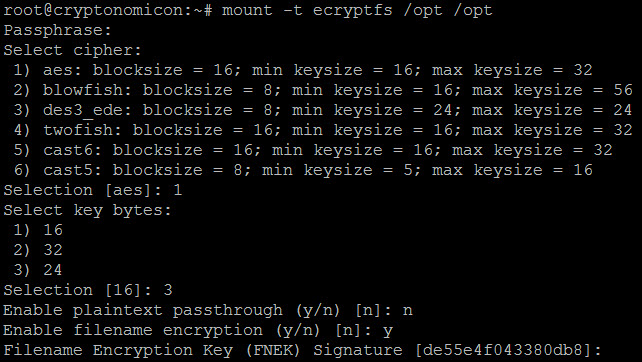
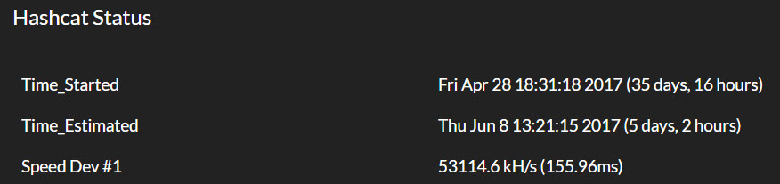
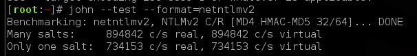
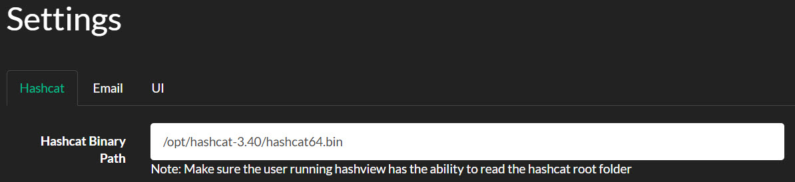
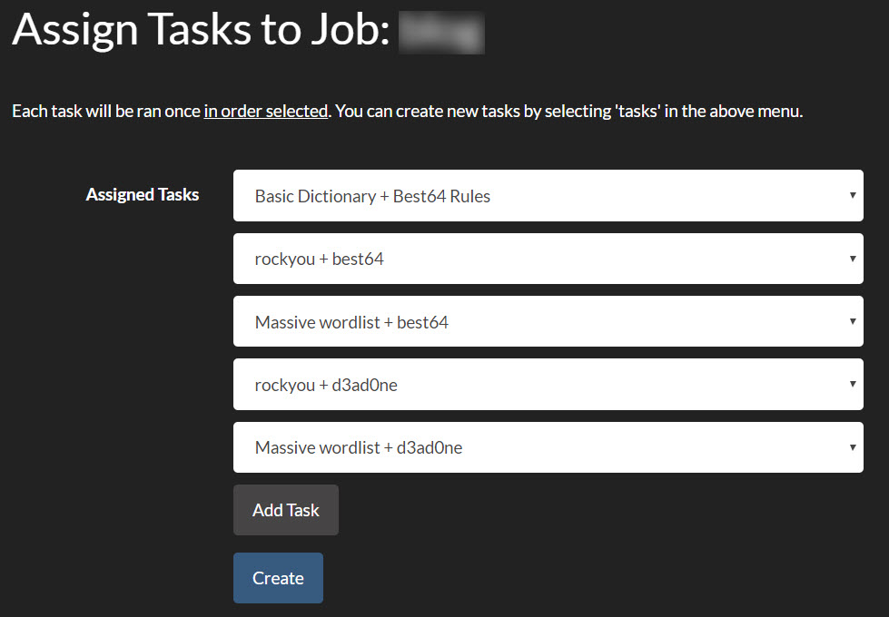
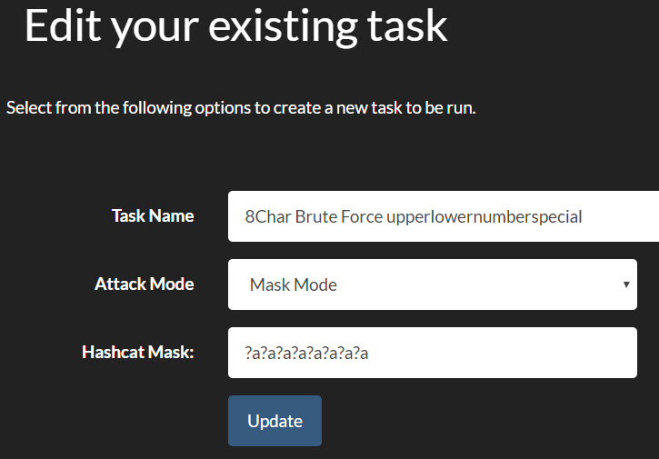

Due to a string of events in a recent forensics investigation, our InfoSec department had ourselves an abandoned graphics design desktop with an [NVIDIA Quadro K5000](https://www.nvidia.com/object/quadro-k5000.html#pdpContent=2). With this windfall, I decided this was a good time to try out something I saw from the folks at [shellntel](https://www.shellntel.com/blog/2017/2/8/how-to-build-a-8-gpu-password-cracker), but with only 1 GPU instead of 8. Gotta start somewhere.

Following their article, I learned a couple of things that I thought I'd share.

## OS install

I would have gone whole disk encryption rather than encrypt partition like shelIntel did. While this may give you some flexibility, mounting an ecryptfs partition every time is a bit annoying (more on this below).

Lots of articles on how to do this with your homedir, but not a lot on manual. Basically take your mount point (in my case, I used /opt) and mount it as ecryptfs. Note that you must answer the questions exactly as you set it up for this to work. I chose to encrypt filenames and forgot it's not the default and panicked when it didn't work on the first go.

Once initialized, move all your files in. I put hashview and hashcat both in /opt since both contain files that, if exposed, I'd find rather unfortunate.

Pros: you don't have to be local to keyboard to boot like you do with LVM encryption. I ended up setting up a Grub password (in case the desktop grows legs), so have to be local anyway. Cons: you have to remember to mount post boot, and remember what your settings were exactly (see the options above). Mess that up and no dice.

And other hardening steps: [Configure SSH](https://www.vultr.com/docs/securing-ssh-on-ubuntu-14-04) (no root login, SSH keys, switch to nonstandard port), [adjust sudoers](http://www.ducea.com/2006/06/18/linux-tips-password-usage-in-sudo-passwd-nopasswd/) to not require password (lazy), fail2ban (adjust for the port change), [Grub password](https://askubuntu.com/questions/656206/how-to-password-protect-grub-menu), [unattended-upgrades](https://linux-audit.com/using-unattended-upgrades-on-debian-and-ubuntu/), [purge-old-kernels](http://manpages.ubuntu.com/manpages/xenial/man1/purge-old-kernels.1.html).

## Benchmarking

Wasn't very intuitive. We have a Kali VM that we'd been using previously for cracking with John, so needed to translate this.

So 53114.6k hashcat vs. 734.153k JtR, looking at almost 7250% improvement. Also frees up our Kali / VM environment if we need to crack something. I'll take it for $free.99.

## Hashview

From the time I initially built this to the end of April, the guys over at [Hashview](http://www.hashview.io) released an [update](http://www.hashview.io/releases/2017/03/22/release-0-6-0-beta.html) which provided a couple of things: NTLMv2 hash support and daemonized process running. Had to do some fanciness with _screen_ to background the running ruby process, but now it's got a ruby _foreman_ process manager.

My only gotcha on this one is that make sure you specify the hashcat binary path that **includes** the actual binary. This wasn't super clear, and took some error log analysis to figure out that hashview was missing the binary. Doh!

## NTDS.dit Cracking

So with a new shiny rig, what do you throw at it? Well of course, what juicier example than your domain's hashes! This took some effort as there's a lot of older posts that made this more challenging than it should have been.

With domain admin creds, I used the [shadow volume process](https://www.trustwave.com/Resources/SpiderLabs-Blog/Tutorial-for-NTDS-goodness-\(VSSADMIN,-WMIS,-NTDS-dit,-SYSTEM\)/) of grabbing the NTDS.dit file and SYSTEM hive (make sure you get both from the **same** domain controller). Threw this over to our Kali box to stage (handle with care).

Alright, now to pull out some hashes. I followed [Didier Stevens' article](https://blog.didierstevens.com/2016/07/13/practice-ntds-dit-file-part-2-extracting-hashes/) to extract, and quickly did the first steps with esedbexport. But the extraction using ntdsxtract ran for 3 days with minimal progress. Being impatient, I started researching and found the guys over at [Sword and Shield](https://www.swordshield.com/2015/10/extracting-password-hashes-from-large-ntds-dit-files/)  with a similar challenge (I, too, was a sad panda) and their solution of [impacket's](https://github.com/CoreSecurity/impacket) [_secretsdump.py_](https://github.com/CoreSecurity/impacket/blob/master/examples/secretsdump.py). Sure enough, within minutes we've got hashes!

One word of warning here, make sure you understand that the hashes pulled via _secretsdump.py_ are _username:hash_, which means you'll shortly find actual people's passwords. Now this means you've got some sensitive info on your hands and your boss may be surprised to find that you now know some important people's passwords. Having the userid makes for good analysis (services accounts with terrible passwords, analytics on distribution of terrible base words across the org, etc.) but means you gotta secure the heck out of this and you have trusted resources working with the data.

## Let's Get Cracking

Throwing this into Hashview is pretty simple. The complexity comes in the Tasks that you setup. Being an initiate to the world of hashcat, I was unaware of hashcat config and masks.  In hindsight, after Google-fu and guessing, I found [Hash Crack](https://www.amazon.com/Hash-Crack-Password-Cracking-Manual/dp/1540444961/ref=sr_1_3?ie=UTF8&qid=1496503110&sr=8-3&keywords=password+crack) primer would have helped immensely.

Wordlists I went with were, of course, rockyou.txt from Kali box. Also read [g0tm1lk's article](https://blog.g0tmi1k.com/2011/06/dictionaries-wordlists/) wordlists for some great context, and grabbed the 18\_in\_1 wordlist. You'll also want to start a special wordlist specific to your organization; we've taken to grabbing cewl results (via a [little helper](https://github.com/kf5grd/cewl_loop/blob/master/cewl-loop.sh)) from our websites (internal and external)  and referencing our known wordlists from previous redteam exercises.

Dictionary rules are also pretty interesting to read up on. [\_NSAKEY's](https://abigisp.com/) [writeup](https://github.com/NSAKEY/nsa-rules) was a good overview. I ended up selecting best64 (comes installed with Hashview) with dictionaries, then [d3ad0ne's ruleset](https://github.com/hashcat/hashcat/blob/master/rules/d3ad0ne.rule) through the dictionaries. Depending on my percentage cracked and time I want to spend, I'll cancel or keep running.

Cool thing about Hashview is you can queue tasks in your order, starting easy to most time intensive. Also, Hashview by design lets you start/stop your cracking if you need to reboot, power goes out, or you spill a brewski on it.

Last tidbit is the ol' bruteforce with [hashcat masks](https://hashcat.net/wiki/doku.php?id=mask_attack). Hashview comes with a 7 character lower alpha bruteforce mask. But what if you want to beyond that? Well looks like this below in Hashview:

We could do 8 chars no specials in 2-3 days, and 8 chars with specials in a week.  Going above that starts to exponentially ratchet up the time. But this was enough to scare IT leadership to move forward with pushing a higher character requirement, so we'll be visiting going above 8 in the near future.

## What's Next

So now you've got some cracked passwords, and are utterly horrified at how bad some people's passwords are. This shined great light on the need to have a password dictionary solution in the organization. We'd received several pentest reports about our easily cracked passwords, and so we purchased [nFront's solution](https://nfrontsecurity.com/products/nfront-password-filter/) which was a breeze to install.  Check out their demo videos, good stuff. O365 and Azure AD still needs to be tackled for us (more to come on  this) but this'll work for on-prem as we're keeping our domain controllers. We easily converted our existing AD password policy into nFront, added the 2+ consecutive character limitation, and tacked on the dictionary option. We went with our own custom dictionary, targeting 500 words at first (so not to incite mass enduser riots). Easy ones first: geo-specific words go in, business units, all the naughty words, password/sesame/etc. Just remember when audit time comes around, you'll need to pull the nFront GPO instead of your normal default domain GPO (it works on a "take the most restrictive" model).

### Feedback Loop

With that baseline, we can institute a closed loop system, cracking domain passwords and taking the top 10 (or X, your pick) passwords and building a prohibited wordlist. I had known about terrible passwords like Welcome01 or Spring2017 going into this, but eyes were open! We even found a whole department that shared the same base word that we never would have guessed! So all of that got tossed into our password dictionary, and we wait for the password rotations to alter password selection choice.

Our idea now is to do this every quarter (which ensures everyone gets one password expiration rotation in), and continuously audit our password stance. This will give us quantitative analysis to see the trends: find additional key choice words which should be prohibited, evaluate if security training around passwords (we're pushing passphrases with spaces) is effective or needs to be tweaked, feedback the terrible passwords into red team wordlists to see if non-AD passwords are terrible (I'm looking at you Linux, network, and application based creds). I'll post a comparative blog post when the data becomes available.

Let me know if you found this useful, are having similar success in your organization, or just want to talk infosec. Hit me up on the Mastadon @sp3nx0r.
