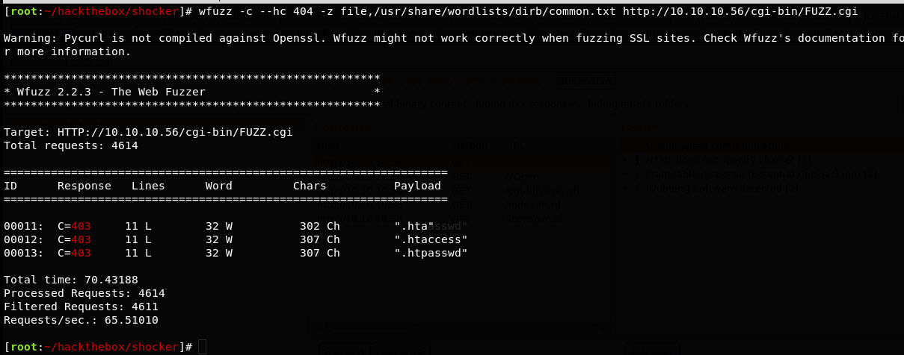
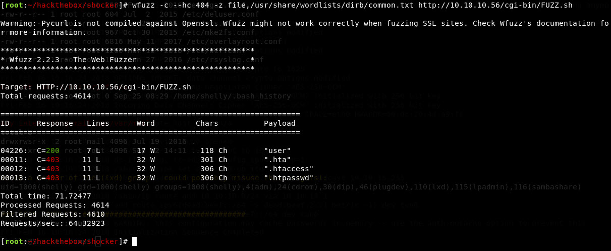

Been a while since I did a blog post, but figured I'd jump on the bandwagon of Hack The Box writeups for retired boxes. Got the message that Valentine was being released on 2018-02-17 and retiring Shocker, which was a nice little box that I had managed to own user and system. So I thought I'd writeup my approach and observations.

Run through a quick nmap, see what we're working with. Since it's an easy box, common ports should trigger something:

Ok, HTTP and SSH. Haven't seen an SSH bruteforce attack vector be meaningful, so let's look at the HTTP service:

Alright, cute jpeg. No other links. Let's start brute force browsing. Whipping out dirb in this instance (it _is_ what they teach you in OSCP).

Ya know, dirb isn't the fastest. Which made me look for something else a bit more powerful than the "easy mode" dirb. (And just forget dirbuster, too flakey for me). Enter [wfuzz](https://github.com/xmendez/wfuzz). Switched over to this and watched the results fly by.

Hmm ok, no dice with a default wordlist with default settings. Not so easy peasey. So, let's look at what we have: Apache webserver with URI of /cgi-bin/ , box name of Shocker, could this be [Shellshock](https://www.surevine.com/shellshocked-a-quick-demo-of-how-easy-it-is-to-exploit/)? Take a look through if you aren't familiar, a good classic vuln, even on [OWASP hitlist](https://www.owasp.org/images/1/1b/Shellshock_-_Tudor_Enache.pdf). So if the tool defaults didn't work, let's try refining our tools.

So we're looking for CGI scripts. Referenced [this site](http://www.parkansky.com/tutorials/bdlogcgi.htm) to remember how CGI worked. So looking for scripts with particular file extensions, could be .cgi or .pl. So ok, fire up the ol' wfuzz again, let's see.

Well crap, we continue to look. Google-fu deployed, and stumbled upon this site regarding bash scripts being able to be used. So let's try .sh filetype:

Ah hah! User.sh, that'll work. So time to fire up the exploit. I used Burpsuite Repeater for this, a bit easier than working CLI since I'm old and legally blind, GUI helps the ol' eyes. Prepped this with a reverse bash shell payload ala [Pentest Monkey's cheatsheet](http://pentestmonkey.net/cheat-sheet/shells/reverse-shell-cheat-sheet).

Alright! We got user, onward and upwards. So let's upload the [standard Linux enumeration](https://github.com/rebootuser/LinEnum) script via wget and a python SimpleHTTPServer. Running this, we see this snippet of interesting-ness:

So the line of attack is to get a perl script to read the contents of the flag file and just sudo it. Easy enough to whip up:

And that's a wrap. Fun little box, enumeration is key. Thanks @hackthebox\_eu and @mrb3n813!
