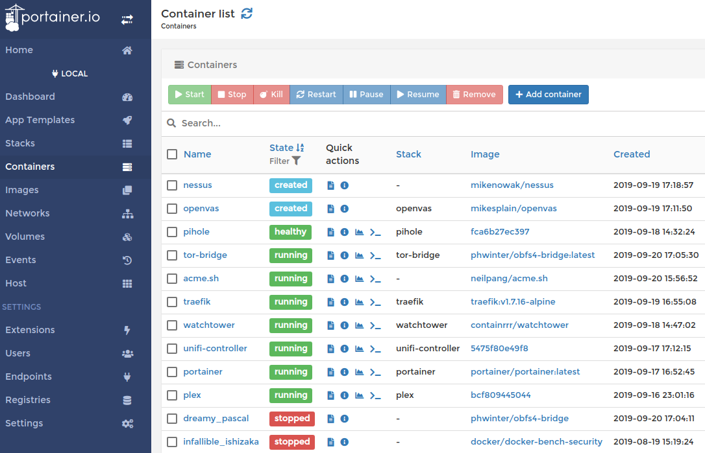

So I saw this on my Twitter feed the other day about how Tor needs [help increasing their number of bridges](https://blog.torproject.org/run-tor-bridges-defend-open-internet):

<blockquote class="twitter-tweet"><p lang="en" dir="ltr">We need more Tor bridges! If you have a server with some spare bandwidth, please consider running a bridge. It&#39;s easy to set up and helps people in censored regions access the open internet. <a href="https://t.co/example">https://t.co/example</a></p>&mdash; The Tor Project (@torproject) <a href="https://twitter.com/torproject/status/1174683934753509377">September 19, 2019</a></blockquote> <script async src="https://platform.twitter.com/widgets.js" charset="utf-8"></script>

So figured I've got my homelab rig running with some spare bandwidth, so why not help out as the impact to my own resources in low and the importance of helping to protect discourse on climate crisis and human rights is high.
Having recently jumped on the container bandwagon with everything running on my homelab (a ThinkServer 440 server running Proxmox hypervisor behind an Untangle firewall with Unifi wifi and managed switches) I figured I'd give it a try and follow their [recently updated instructions](https://community.torproject.org/relay/setup/bridge/) which included a [Docker install.](https://community.torproject.org/relay/setup/bridge/docker/)



So first oddity is the bash script they want you to just pull from the internet and run... Which you should never just blindly do, so let's take a look at that script:

```bash
#!/usr/bin/env bash
#
# This script launches an obfs4proxy docker container. Don't start the docker
# container directly with docker. We need this wrapper script because it
# automatically determines a random OR port and obfs4 port.
#
# Note that we link to this script from:
# If we change the path to this script, we must update the above instructions.

# Get the bridge operator's email address.
if [ $# -ne 1 ]; then
    >&2 echo -e "Usage: $0 EMAIL_ADDR\n"
    >&2 echo "Please provide your email address so we're able to reach you in" \
        "case of problems with your bridge."
    exit 1
fi
EMAIL="$1"

function get_port {
    # Here's where the following code snippet comes from:
    # read LOWERPORT UPPERPORT < /proc/sys/net/ipv4/ip_local_port_range
    while :; do
        port="`shuf -i $LOWERPORT-$UPPERPORT -n 1`"
        ss -lpn | grep -q ":$port" || break
    done
    echo "$port"
}

# Determine random ports.
OR_PORT=$(get_port)
PT_PORT=$(get_port)

# Keep getting a new PT port until it's different from our OR port. This loop
# will only run if we happened to choose the same port for both variables, which
# is unlikely.
while [ "$PT_PORT" -eq "$OR_PORT" ]; do
    PT_PORT=$(get_port)
done

# Pass our two ports and email address to the container using environment
# variables.
docker run -d \
    -e "OR_PORT=$OR_PORT" -e "PT_PORT=$PT_PORT" -e "EMAIL=$EMAIL" \
    -p "$OR_PORT":"$OR_PORT" -p "$PT_PORT":"$PT_PORT" \
    phwinter/obfs4-bridge:latest
```

The scripts grabs two random high ports and spins up the container with those and your email. Which makes sense since they want random ports to avoid censorship via easily distinguishing pattern, but is terrible if you need to port forward as this would require your port forwarding rules to update every time the container is rebuilt. So needless to say, I didn't use this script and wrote a Docker Compose file (see below for finished result) with the image ([phwinter/obfs4-bridge](https://hub.docker.com/r/phwinter/obfs4-bridge)) and passed my own randomly picked ports.

So this spun up super easy, and I got some info from `docker logs` that it was successful. So next was to find my fingerprints per the blog post so I could tell them I was helping out and maybe win some swag (who doesn't love swag). This required some Googling as it wasn't readily apparent, mostly because this particular image didn't have a symbolic link between the Tor log file (located at `/var/log/tor/log` based on [this FAQ](https://2019.www.torproject.org/docs/faq#Logs)) with `stdout` so that Docker would pick it up with its logging driver. This is where your first initialized fingerprint ends up getting echoed out. Found [this blogpost](https://docs.docker.com/config/containers/logging/) that explained this is a common practice, which I never realized that's how it was done, I just embraced the Docker magic and enjoyed logs. So did this myself by dropping in to a shell and adding the link

```bash
docker exec -it tor-bridge /bin/sh ln -sf /dev/stdout /var/log/tor/log
```

Which works for the time being, I've dropped a note to the official image maintainer to add that to his Dockerfile in the future. One other modification I did to this official image was add a persistent volume. Tor generates all the keys, certs, and fingerprints it needs upon initialization and you really want to store that data persistently so that you can keep the built up reputation as your container gets rebuilt. All this data is stored in `/var/lib/tor`, so I added a mountpoint for `/var/lib/tor`. Also, after some Googling and looking at others' Docker Compose files (like [@jessfraz's](https://blog.jessfraz.com/post/running-a-tor-relay-with-docker/)), I added the localtime mountpoint for time sync. So all in, here's my Docker Compose file:

```docker-compose
version: '3'
services:
  tor-bridge:
    image: phwinter/obfs4-bridge:latest
    hostname: tor-bridge
    ports:
      - ${OR_PORT}:${OR_PORT}
      - ${PT_PORT}:${PT_PORT}
    environment:
      - OR_PORT=${OR_PORT}
      - PT_PORT=${PT_PORT}
      - EMAIL=${EMAIL}
    volumes:
      - /etc/localtime:/etc/localtime:ro
      - ./:/var/lib/tor
    container_name: tor-bridge
    restart: unless-stopped
```

After I got this all up and running, I noticed my bandwidth util for this bridge was pretty uninteresting. Happened to come across [this nice blog post](https://blog.torproject.org/lifecycle-new-relay) that talks about the lifecycle of a new relay/bridge and found it super helpful. So I'm in the incubation period right now, periodically checking on the heartbeats and letting the bake-in process continue.

UPDATE: So after playing around with this and noticing that I'd frequently be reported as offline on the relay tracker, I decided to shop around on Docker containers. Besides the above gripes on the official image, it was a Debian based container vs. small Alpine, it utilized a startup script rather than just kicking tor binary off which generated the torrc config file. So I found [chriswayg's version](https://github.com/chriswayg/tor-alpine) which I really liked because the image was clean and stayed current (his base OS would refresh automatically, his build script pulled the latest Tor binaries down). So utilizing this image, with my torrc config file in hand (having added a line to specify the User (`tord`) and the `DataDirectory` as `/var/lib/tor`), I built my Docker Compose file and am now in business.
